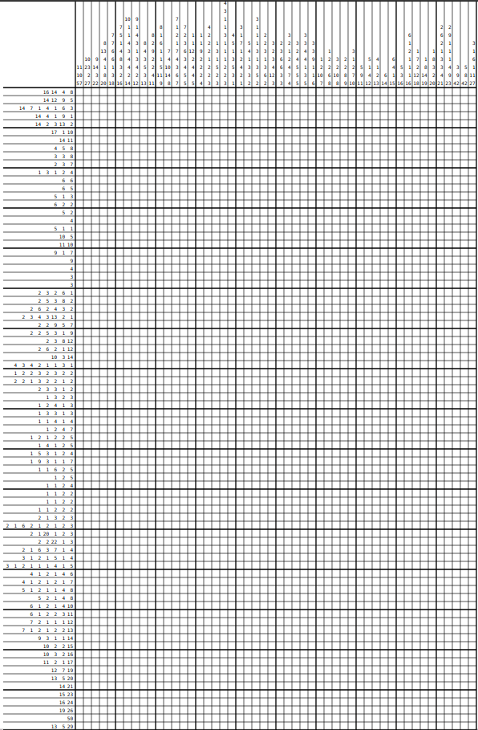
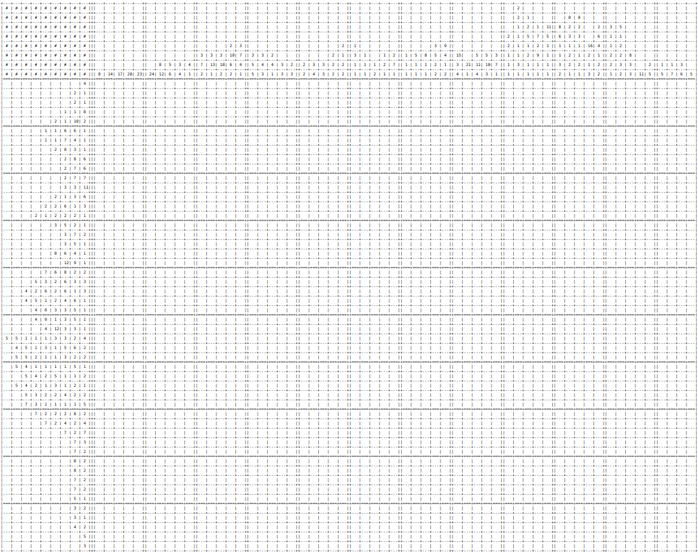
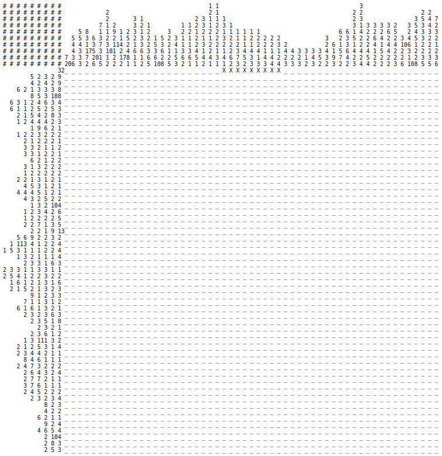
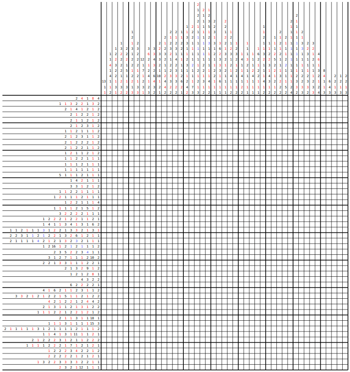

|Build Status| |Coverage Status|

Nonogram solver
===============

Solve the `nonogram puzzles <https://en.wikipedia.org/wiki/Nonogram>`_
and see the solution process.
Currently supports black-and-white and color puzzles
(see file format in ``examples/hello.txt``)
with the unlimited size. Also you can solve puzzles
from http://webpbn.com that have thousands of them.

Install
-------

.. code-block::

    pip install pynogram

You can also install `numpy` for better performance
(it's not listed in requirements to keep the package lightweight).
However numpy does not work with PyPy interpreter.

Usage
-----

Console
~~~~~~~

just to make sure it works

.. code-block::

    $ pynogram
    # # # # # # # # #               1 1
    # # # # # # # # #               1 1               1   1     5
    # # # # # # # # # 7 1 1 1 7 0 3 1 1 2 0 6 0 6 0 3 1 5 1 3 0 1
                1 1 1 ⬛ . . . ⬛ . . . . . . . . . . . . . . . . ⬛
            1 1 1 1 1 ⬛ . . . ⬛ . . . . . . ⬛ . ⬛ . . . . . . . ⬛
        1 1 2 1 1 3 1 ⬛ . . . ⬛ . . ⬛ ⬛ . . ⬛ . ⬛ . . ⬛ ⬛ ⬛ . . ⬛
    5 1 1 1 1 1 1 1 1 ⬛ ⬛ ⬛ ⬛ ⬛ . ⬛ . . ⬛ . ⬛ . ⬛ . ⬛ . ⬛ . ⬛ . ⬛
    1 1 4 1 1 1 1 1 1 ⬛ . . . ⬛ . ⬛ ⬛ ⬛ ⬛ . ⬛ . ⬛ . ⬛ . ⬛ . ⬛ . ⬛
      1 1 1 1 1 1 1 1 ⬛ . . . ⬛ . ⬛ . . . . ⬛ . ⬛ . ⬛ . ⬛ . ⬛ . .
        1 1 2 1 1 3 1 ⬛ . . . ⬛ . . ⬛ ⬛ . . ⬛ . ⬛ . . ⬛ ⬛ ⬛ . . ⬛

solve local puzzle

.. code-block::

    $ pynogram --board=winter --draw-final
    # # # # #                         2
    # # # # #         1 1     4 1     2 4   4 5   2   7
    # # # # # 5 7 2 1 3 3 7   4 6 7 6 3 4 4 4 3 6 2 5 1 125 1
    # # # # # 6 3 7 6 6 6 4 111 1 4 5 1 1 7 1 1 5 4 1 1 1 6 103
    # # # # # 4 5 5 6 6 7 7 6 4 3 3 2 2 1 2 2 1 1 1 1 1 1 3 1 8
      1 5 114 ⬛ . ⬛ ⬛ ⬛ ⬛ ⬛ . ⬛ ⬛ ⬛ ⬛ ⬛ ⬛ ⬛ ⬛ ⬛ ⬛ ⬛ . . ⬛ ⬛ ⬛ ⬛
    3 3 9 2 1 ⬛ ⬛ ⬛ . . . ⬛ ⬛ ⬛ . ⬛ ⬛ ⬛ ⬛ ⬛ ⬛ ⬛ ⬛ ⬛ . . ⬛ ⬛ . ⬛
      2 8 5 5 ⬛ ⬛ . . ⬛ ⬛ ⬛ ⬛ ⬛ ⬛ ⬛ ⬛ . ⬛ ⬛ ⬛ ⬛ ⬛ . . ⬛ ⬛ ⬛ ⬛ ⬛
        2 145 ⬛ ⬛ . . ⬛ ⬛ ⬛ ⬛ ⬛ ⬛ ⬛ ⬛ ⬛ ⬛ ⬛ ⬛ ⬛ ⬛ . ⬛ ⬛ ⬛ ⬛ ⬛ .
    2 4 4 2 6 ⬛ ⬛ . . ⬛ ⬛ ⬛ ⬛ . ⬛ ⬛ ⬛ ⬛ . . . ⬛ ⬛ . ⬛ ⬛ ⬛ ⬛ ⬛ ⬛
      2 6 5 2 . ⬛ ⬛ . . . ⬛ ⬛ ⬛ ⬛ ⬛ ⬛ . . . . . ⬛ ⬛ ⬛ ⬛ ⬛ . ⬛ ⬛
          117 ⬛ ⬛ ⬛ ⬛ ⬛ ⬛ ⬛ ⬛ ⬛ ⬛ ⬛ . . . . . . . ⬛ ⬛ ⬛ ⬛ ⬛ ⬛ ⬛
      6 3 3 6 ⬛ ⬛ ⬛ ⬛ ⬛ ⬛ . ⬛ ⬛ ⬛ . . . ⬛ ⬛ ⬛ . . . ⬛ ⬛ ⬛ ⬛ ⬛ ⬛
      1 7 5 5 ⬛ . ⬛ ⬛ ⬛ ⬛ ⬛ ⬛ ⬛ . . . ⬛ ⬛ ⬛ ⬛ ⬛ . . . ⬛ ⬛ ⬛ ⬛ ⬛
        8 7 4 ⬛ ⬛ ⬛ ⬛ ⬛ ⬛ ⬛ ⬛ . . . ⬛ ⬛ ⬛ ⬛ ⬛ ⬛ ⬛ . . . ⬛ ⬛ ⬛ ⬛
        8 9 4 ⬛ ⬛ ⬛ ⬛ ⬛ ⬛ ⬛ ⬛ . . ⬛ ⬛ ⬛ ⬛ ⬛ ⬛ ⬛ ⬛ ⬛ . . ⬛ ⬛ ⬛ ⬛
        121 8 ⬛ ⬛ ⬛ ⬛ ⬛ ⬛ ⬛ ⬛ ⬛ ⬛ ⬛ ⬛ . . ⬛ . . ⬛ ⬛ ⬛ ⬛ ⬛ ⬛ ⬛ ⬛
        2 1 2 . . . . . . . . . . ⬛ ⬛ . . ⬛ . . ⬛ ⬛ . . . . . .
          9 3 . . . . . . . . . . ⬛ ⬛ ⬛ ⬛ ⬛ ⬛ ⬛ ⬛ ⬛ . ⬛ ⬛ ⬛ . .
            2 . . . . . . . . . . . . . . . . . . . . . . ⬛ ⬛ .
            9 . . . . . . . . . . . . . . ⬛ ⬛ ⬛ ⬛ ⬛ ⬛ ⬛ ⬛ ⬛ . .
            6 . . . . . . . . . . ⬛ ⬛ ⬛ ⬛ ⬛ ⬛ . . . . . . . . .
            6 . . . . . . . ⬛ ⬛ ⬛ ⬛ ⬛ ⬛ . . . . . . . . . . . .
            6 . . . . . ⬛ ⬛ ⬛ ⬛ ⬛ ⬛ . . . . . . . . . . . . . .
            7 . . . ⬛ ⬛ ⬛ ⬛ ⬛ ⬛ ⬛ . . . . . . . . . . . . . . .
            8 . ⬛ ⬛ ⬛ ⬛ ⬛ ⬛ ⬛ ⬛ . . . . . . . . . . . . . . . .
            8 ⬛ ⬛ ⬛ ⬛ ⬛ ⬛ ⬛ ⬛ . . . . . . . . . . . . . . . . .
            8 ⬛ ⬛ ⬛ ⬛ ⬛ ⬛ ⬛ ⬛ . . . . . . . . . . . . . . . . .
            7 ⬛ ⬛ ⬛ ⬛ ⬛ ⬛ ⬛ . . . . . . . . . . . . . . . . . .
            7 ⬛ ⬛ ⬛ ⬛ ⬛ ⬛ ⬛ . . . . . . . . . . . . . . . . . .

solve simple black-and-white puzzle

.. code-block::

    $ pynogram --pbn=3 --draw-final
    # # # #           3 3
    # # # #         2 1 2 4 3 3 2
    # # # #       3 1 2 1 3 5 1 1 3
    # # # #       5 5 1 1 1 1 5 5 5
    # # # # 5 9 113 2 3 3 3 3 3 2 3 119 5
          5 . . . . . ⬛ ⬛ ⬛ ⬛ ⬛ . . . . .
          9 . . . ⬛ ⬛ ⬛ ⬛ ⬛ ⬛ ⬛ ⬛ ⬛ . . .
          11. . ⬛ ⬛ ⬛ ⬛ ⬛ ⬛ ⬛ ⬛ ⬛ ⬛ ⬛ . .
      3 1 3 . ⬛ ⬛ ⬛ . . . ⬛ . . . ⬛ ⬛ ⬛ .
    2 3 3 2 . ⬛ ⬛ . ⬛ ⬛ ⬛ . ⬛ ⬛ ⬛ . ⬛ ⬛ .
    4 1 1 4 ⬛ ⬛ ⬛ ⬛ . . ⬛ . ⬛ . . ⬛ ⬛ ⬛ ⬛
        6 8 ⬛ ⬛ ⬛ ⬛ ⬛ ⬛ . ⬛ ⬛ ⬛ ⬛ ⬛ ⬛ ⬛ ⬛
        6 8 ⬛ ⬛ ⬛ ⬛ ⬛ ⬛ . ⬛ ⬛ ⬛ ⬛ ⬛ ⬛ ⬛ ⬛
        5 9 ⬛ ⬛ ⬛ ⬛ ⬛ . ⬛ ⬛ ⬛ ⬛ ⬛ ⬛ ⬛ ⬛ ⬛
        5 6 ⬛ ⬛ ⬛ ⬛ ⬛ . . . . ⬛ ⬛ ⬛ ⬛ ⬛ ⬛
      2 7 2 . ⬛ ⬛ . ⬛ ⬛ ⬛ ⬛ ⬛ ⬛ ⬛ . ⬛ ⬛ .
        3 3 . ⬛ ⬛ ⬛ . . . . . . . ⬛ ⬛ ⬛ .
          11. . ⬛ ⬛ ⬛ ⬛ ⬛ ⬛ ⬛ ⬛ ⬛ ⬛ ⬛ . .
          9 . . . ⬛ ⬛ ⬛ ⬛ ⬛ ⬛ ⬛ ⬛ ⬛ . . .
          5 . . . . . ⬛ ⬛ ⬛ ⬛ ⬛ . . . . .

solve simple color puzzle http://webpbn.com/898

.. code-block::

    $ pynogram --pbn=898 --draw-final
    # # # # # # # #                   1
    # # # # # # # #             1     1
    # # # # # # # #     2   5   1     1     1
    # # # # # # # #     1 4 1 6 2     1 5 4 1
    # # # # # # # # 2   3 1 2 1 1     2 1 1 3
    # # # # # # # # 1   1 3 1 2 1 6 6 3 2 3 1
    # # # # # # # # 2 7 1 1 2 2 9 8 7 2 2 1 2 7 5
                  11. . % % % % % % % % % % % . .
      5 1 2 1 2 1 1 . % % % % % * % % * % % * % .
              2 1 12% % * % % % % % % % % % % % %
              9 1 5 % % % % % % % % % * % % % % %
    1 2 1 2 1 4 1 3 * % % X % % * % % % % X % % %
      4 1 5 1 1 1 2 % % % % X % % % % % X % * % %
        2 1 2 2 1 5 % % * % % X X . . X % % % % %
            4 2 1 4 . % % % % . X X . X % % % % .
                  6 . . . . X X X X X X . . . . .
                  4 . . . . . X X X X . . . . . .
                  3 . . . . . . X X X . . . . . .
                  3 . . . . . . X X X . . . . . .
                  3 . . . . . . X X X . . . . . .
                  7 . . . . X X X X X X X . . . .
                  9 . . . X X X X X X X X X . . .

Web
~~~

- **to use the web solver you have to install additional subpackage:**

  ``pip install pynogram[web]`` and **start the server**: ``pynogram-web``

- you can solve any of local puzzles (with */board/local* path)
  or webpbn puzzles (with */board/pbn* path)

- you can specify render mode (with the *?render=MODE* argument).
  Now the four are supported:

  - **svg** (default) - draws a nice vector image. It can seriously
    slows down the viewing and solving on a large boards (e.g. 50x50 and more),
    since the resulted SVG can be pretty huge.
    In the future releases I plan to apply more advanced SVG drawing to eliminate the problem.

  - **text** - lightweight text format similar to the one that draws on the console.

  - **text-grid** - slightly more advanced ASCII-graphic that renders
    the grid between cells. However it requires more screen space.

  - **text-grid-bold** - almost like the last, but also draws bold lines,
    splitting the whole board into 5x5 squares (remember puzzles in those magazines?)

http://localhost:3145/board/local/einstein?render=svg

http://localhost:3145/board/local/MLP?render=text-grid-bold

http://localhost:3145/board/pbn/2040?render=text

http://localhost:3145/board/pbn/2196

References
----------

The following sites and articles were used when making this solver:

1. `The 'pbnsolve' Paint-by-Number Puzzle Solver by Jan Wolter
<http://webpbn.com/pbnsolve.html>`_

2. `Решение японских кроссвордов с использованием конечных автоматов
<http://window.edu.ru/resource/781/57781>`_

3. `'Nonolib' library by Dr. Steven Simpson
<http://www.lancaster.ac.uk/~simpsons/nonogram/howitworks>`_

4. `Solving Nonograms by combining relaxations
<http://citeseerx.ist.psu.edu/viewdoc/download?doi=10.1.1.177.76&rep=rep1&type=pdf>`_

5. `The BGU Nonograms Project
<https://www.cs.bgu.ac.il/~benr/nonograms/>`_

-----

The software developed and tested on Ubuntu 16.04 LTS using CPython 2.7 and 3.5.
Also PyPy 2.7 and 3.5 are supported.
If you have any issues, drop a line to the
`project site <https://github.com/tsionyx/pynogram/issues>`_.

.. |Build Status| image:: https://img.shields.io/travis/tsionyx/pynogram.svg
    :target: https://travis-ci.org/tsionyx/pynogram
.. |Coverage Status| image:: https://img.shields.io/coveralls/github/tsionyx/pynogram.svg
    :target: https://coveralls.io/github/tsionyx/pynogram
