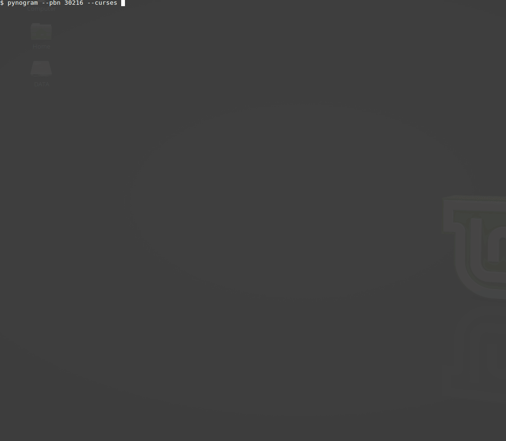
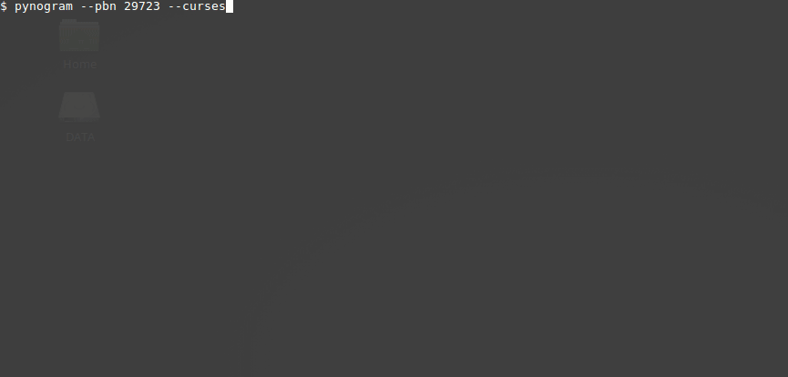
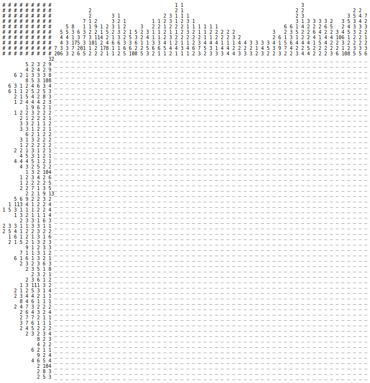

|PyPI| |PyPI - Python Version| |PyPI - Implementation|

|Build Status| |Coverage Status|

Nonogram solver
===============

Solve the `nonogram puzzles <https://en.wikipedia.org/wiki/Nonogram>`_
and see the solution process.
Supports both black-and-white and color puzzles with the unlimited
(at least in theory) size. Also, you can solve puzzles
from http://webpbn.com that have thousands of them.

Install
-------

.. code-block::

    pip install pynogram

You can also install *numpy* for better performance
(it's not listed in requirements to keep the package lightweight).
However, numpy does not work with PyPy interpreter.

Console
-------

Console-based solver works on a wide variety of pythons: python2.7+, python3.5+, PyPy 2.7, PyPy 3.5.
The best performance, however, achieved on PyPy (version 3 is always preferable), so try it out.

Firstly, make sure it works (if not, see the `Errors`_ section):

.. code-block::

    $ pynogram
    # # # # # # # # #               1 1
    # # # # # # # # #               1 1               1   1     5
    # # # # # # # # # 7 1 1 1 7 0 3 1 1 2 0 6 0 6 0 3 1 5 1 3 0 1
                1 1 1 ⬛ . . . ⬛ . . . . . . . . . . . . . . . . ⬛
            1 1 1 1 1 ⬛ . . . ⬛ . . . . . . ⬛ . ⬛ . . . . . . . ⬛
        1 1 2 1 1 3 1 ⬛ . . . ⬛ . . ⬛ ⬛ . . ⬛ . ⬛ . . ⬛ ⬛ ⬛ . . ⬛
    5 1 1 1 1 1 1 1 1 ⬛ ⬛ ⬛ ⬛ ⬛ . ⬛ . . ⬛ . ⬛ . ⬛ . ⬛ . ⬛ . ⬛ . ⬛
    1 1 4 1 1 1 1 1 1 ⬛ . . . ⬛ . ⬛ ⬛ ⬛ ⬛ . ⬛ . ⬛ . ⬛ . ⬛ . ⬛ . ⬛
      1 1 1 1 1 1 1 1 ⬛ . . . ⬛ . ⬛ . . . . ⬛ . ⬛ . ⬛ . ⬛ . ⬛ . .
        1 1 2 1 1 3 1 ⬛ . . . ⬛ . . ⬛ ⬛ . . ⬛ . ⬛ . . ⬛ ⬛ ⬛ . . ⬛

You can solve puzzles from different sources:

- local puzzles, embedded inside the package
- local puzzles, created by yourself
- puzzles from http://webpbn.com (without downloading)
- locally saved webpbn puzzles (mainly for development/debug purpose)

`Local <pynogram/examples/>`_
~~~~~~~~~~~~~~~~~~~~~~~~~~~~~

To solve one of the embedded puzzles do the ``pynogram --board {NAME}`` (or simply *-b*)
where NAME is the name of the file (you can skip the *.txt* extension).
See the list of all embedded puzzles in the *pynogram/examples/* of your installation folder [1]_.

.. code-block::

    $ pynogram --board=winter --draw-final
    # # # # #                         2
    # # # # #         1 1     4 1     2 4   4 5   2   7
    # # # # # 5 7 2 1 3 3 7   4 6 7 6 3 4 4 4 3 6 2 5 1 125 1
    # # # # # 6 3 7 6 6 6 4 111 1 4 5 1 1 7 1 1 5 4 1 1 1 6 103
    # # # # # 4 5 5 6 6 7 7 6 4 3 3 2 2 1 2 2 1 1 1 1 1 1 3 1 8
      1 5 114 ⬛ . ⬛ ⬛ ⬛ ⬛ ⬛ . ⬛ ⬛ ⬛ ⬛ ⬛ ⬛ ⬛ ⬛ ⬛ ⬛ ⬛ . . ⬛ ⬛ ⬛ ⬛
    3 3 9 2 1 ⬛ ⬛ ⬛ . . . ⬛ ⬛ ⬛ . ⬛ ⬛ ⬛ ⬛ ⬛ ⬛ ⬛ ⬛ ⬛ . . ⬛ ⬛ . ⬛
      2 8 5 5 ⬛ ⬛ . . ⬛ ⬛ ⬛ ⬛ ⬛ ⬛ ⬛ ⬛ . ⬛ ⬛ ⬛ ⬛ ⬛ . . ⬛ ⬛ ⬛ ⬛ ⬛
        2 145 ⬛ ⬛ . . ⬛ ⬛ ⬛ ⬛ ⬛ ⬛ ⬛ ⬛ ⬛ ⬛ ⬛ ⬛ ⬛ ⬛ . ⬛ ⬛ ⬛ ⬛ ⬛ .
    2 4 4 2 6 ⬛ ⬛ . . ⬛ ⬛ ⬛ ⬛ . ⬛ ⬛ ⬛ ⬛ . . . ⬛ ⬛ . ⬛ ⬛ ⬛ ⬛ ⬛ ⬛
      2 6 5 2 . ⬛ ⬛ . . . ⬛ ⬛ ⬛ ⬛ ⬛ ⬛ . . . . . ⬛ ⬛ ⬛ ⬛ ⬛ . ⬛ ⬛
          117 ⬛ ⬛ ⬛ ⬛ ⬛ ⬛ ⬛ ⬛ ⬛ ⬛ ⬛ . . . . . . . ⬛ ⬛ ⬛ ⬛ ⬛ ⬛ ⬛
      6 3 3 6 ⬛ ⬛ ⬛ ⬛ ⬛ ⬛ . ⬛ ⬛ ⬛ . . . ⬛ ⬛ ⬛ . . . ⬛ ⬛ ⬛ ⬛ ⬛ ⬛
      1 7 5 5 ⬛ . ⬛ ⬛ ⬛ ⬛ ⬛ ⬛ ⬛ . . . ⬛ ⬛ ⬛ ⬛ ⬛ . . . ⬛ ⬛ ⬛ ⬛ ⬛
        8 7 4 ⬛ ⬛ ⬛ ⬛ ⬛ ⬛ ⬛ ⬛ . . . ⬛ ⬛ ⬛ ⬛ ⬛ ⬛ ⬛ . . . ⬛ ⬛ ⬛ ⬛
        8 9 4 ⬛ ⬛ ⬛ ⬛ ⬛ ⬛ ⬛ ⬛ . . ⬛ ⬛ ⬛ ⬛ ⬛ ⬛ ⬛ ⬛ ⬛ . . ⬛ ⬛ ⬛ ⬛
        121 8 ⬛ ⬛ ⬛ ⬛ ⬛ ⬛ ⬛ ⬛ ⬛ ⬛ ⬛ ⬛ . . ⬛ . . ⬛ ⬛ ⬛ ⬛ ⬛ ⬛ ⬛ ⬛
        2 1 2 . . . . . . . . . . ⬛ ⬛ . . ⬛ . . ⬛ ⬛ . . . . . .
          9 3 . . . . . . . . . . ⬛ ⬛ ⬛ ⬛ ⬛ ⬛ ⬛ ⬛ ⬛ . ⬛ ⬛ ⬛ . .
            2 . . . . . . . . . . . . . . . . . . . . . . ⬛ ⬛ .
            9 . . . . . . . . . . . . . . ⬛ ⬛ ⬛ ⬛ ⬛ ⬛ ⬛ ⬛ ⬛ . .
            6 . . . . . . . . . . ⬛ ⬛ ⬛ ⬛ ⬛ ⬛ . . . . . . . . .
            6 . . . . . . . ⬛ ⬛ ⬛ ⬛ ⬛ ⬛ . . . . . . . . . . . .
            6 . . . . . ⬛ ⬛ ⬛ ⬛ ⬛ ⬛ . . . . . . . . . . . . . .
            7 . . . ⬛ ⬛ ⬛ ⬛ ⬛ ⬛ ⬛ . . . . . . . . . . . . . . .
            8 . ⬛ ⬛ ⬛ ⬛ ⬛ ⬛ ⬛ ⬛ . . . . . . . . . . . . . . . .
            8 ⬛ ⬛ ⬛ ⬛ ⬛ ⬛ ⬛ ⬛ . . . . . . . . . . . . . . . . .
            8 ⬛ ⬛ ⬛ ⬛ ⬛ ⬛ ⬛ ⬛ . . . . . . . . . . . . . . . . .
            7 ⬛ ⬛ ⬛ ⬛ ⬛ ⬛ ⬛ . . . . . . . . . . . . . . . . . .
            7 ⬛ ⬛ ⬛ ⬛ ⬛ ⬛ ⬛ . . . . . . . . . . . . . . . . . .

solve simple color puzzle (UK flag)

.. code-block::

    $ pynogram -b uk
    # # # # # # #       1 1 2 2 3 3 4                       4 3 3 2 2 1 1
    # # # # # # #       1 2 1 2 1 2 1                       1 2 1 2 1 2 1
    # # # # # # # 1 1 2 4 3 3 2 2 1 1                       1 1 2 2 3 3 4 2 1 1
    # # # # # # # 5 5 4 3 3 3 3 3 3 3                       3 3 3 3 3 3 3 4 5 5
    # # # # # # # 3 3 3 4 3 3 2 2 1 1 4 5 5 6       6 5 5 4 1 1 2 2 3 3 4 3 3 3
    # # # # # # # 5 5 4 1 2 1 2 1 2 1 7 5 5 3       3 5 5 7 1 2 1 2 1 2 1 4 5 5
    # # # # # # # 1 1 2 1 1 2 2 3 3 4 4 5 5 6 1515156 5 5 4 4 3 3 2 2 1 1 2 1 1
        3 113 113 % % % * * * * * * * * * * * % % % * * * * * * * * * * * % % %
    2 3 9 3 9 3 2 * * % % % * * * * * * * * * % % % * * * * * * * * * % % % * *
    4 3 7 3 7 3 4 * * * * % % % * * * * * * * % % % * * * * * * * % % % * * * *
    6 3 5 3 5 3 6 * * * * * * % % % * * * * * % % % * * * * * % % % * * * * * *
    8 3 3 3 3 3 8 * * * * * * * * % % % * * * % % % * * * % % % * * * * * * * *
    103 1 3 1 3 10* * * * * * * * * * % % % * % % % * % % % * * * * * * * * * *
                31% % % % % % % % % % % % % % % % % % % % % % % % % % % % % % %
                31% % % % % % % % % % % % % % % % % % % % % % % % % % % % % % %
                31% % % % % % % % % % % % % % % % % % % % % % % % % % % % % % %
    103 1 3 1 3 10* * * * * * * * * * % % % * % % % * % % % * * * * * * * * * *
    8 3 3 3 3 3 8 * * * * * * * * % % % * * * % % % * * * % % % * * * * * * * *
    6 3 5 3 5 3 6 * * * * * * % % % * * * * * % % % * * * * * % % % * * * * * *
    4 3 7 3 7 3 4 * * * * % % % * * * * * * * % % % * * * * * * * % % % * * * *
    2 3 9 3 9 3 2 * * % % % * * * * * * * * * % % % * * * * * * * * * % % % * *
        3 113 113 % % % * * * * * * * * * * * % % % * * * * * * * * * * * % % %

User-defined
~~~~~~~~~~~~

To create the puzzle by yourself, learn the format first. Do not panic, it is very simple!
Find out the *pynogram/examples/hello.txt* file inside your installation folder [1]_
and copy it to create a new puzzle. This file is the working puzzle which gets solved when
you test the app with the simple ``pynogram`` call.
To run the solver on your crafted file hit the same command but specify the path to your file:

.. code-block::

    $ cp /install/folder/pynogram/examples/hello.txt my-new-puzzle.txt
    $ pynogram -b my-new-puzzle.txt
    # # # # # # # # #               1 1
    # # # # # # # # #               1 1               1   1     5
    # # # # # # # # # 7 1 1 1 7 0 3 1 1 2 0 6 0 6 0 3 1 5 1 3 0 1
                1 1 1 ⬛ . . . ⬛ . . . . . . . . . . . . . . . . ⬛
            1 1 1 1 1 ⬛ . . . ⬛ . . . . . . ⬛ . ⬛ . . . . . . . ⬛
        1 1 2 1 1 3 1 ⬛ . . . ⬛ . . ⬛ ⬛ . . ⬛ . ⬛ . . ⬛ ⬛ ⬛ . . ⬛
    5 1 1 1 1 1 1 1 1 ⬛ ⬛ ⬛ ⬛ ⬛ . ⬛ . . ⬛ . ⬛ . ⬛ . ⬛ . ⬛ . ⬛ . ⬛
    1 1 4 1 1 1 1 1 1 ⬛ . . . ⬛ . ⬛ ⬛ ⬛ ⬛ . ⬛ . ⬛ . ⬛ . ⬛ . ⬛ . ⬛
      1 1 1 1 1 1 1 1 ⬛ . . . ⬛ . ⬛ . . . . ⬛ . ⬛ . ⬛ . ⬛ . ⬛ . .
        1 1 2 1 1 3 1 ⬛ . . . ⬛ . . ⬛ ⬛ . . ⬛ . ⬛ . . ⬛ ⬛ ⬛ . . ⬛

Webpbn
~~~~~~

Visit the http://webpbn.com/ to see thousands of puzzles waiting for you to solve.
To run the solver on any of them just specify the puzzle id with the *--pbn* flag:

simple black-and-white puzzle http://webpbn.com/3

.. code-block::

    $ pynogram --pbn=3 --draw-final
    # # # #           3 3
    # # # #         2 1 2 4 3 3 2
    # # # #       3 1 2 1 3 5 1 1 3
    # # # #       5 5 1 1 1 1 5 5 5
    # # # # 5 9 113 2 3 3 3 3 3 2 3 119 5
          5 . . . . . ⬛ ⬛ ⬛ ⬛ ⬛ . . . . .
          9 . . . ⬛ ⬛ ⬛ ⬛ ⬛ ⬛ ⬛ ⬛ ⬛ . . .
          11. . ⬛ ⬛ ⬛ ⬛ ⬛ ⬛ ⬛ ⬛ ⬛ ⬛ ⬛ . .
      3 1 3 . ⬛ ⬛ ⬛ . . . ⬛ . . . ⬛ ⬛ ⬛ .
    2 3 3 2 . ⬛ ⬛ . ⬛ ⬛ ⬛ . ⬛ ⬛ ⬛ . ⬛ ⬛ .
    4 1 1 4 ⬛ ⬛ ⬛ ⬛ . . ⬛ . ⬛ . . ⬛ ⬛ ⬛ ⬛
        6 8 ⬛ ⬛ ⬛ ⬛ ⬛ ⬛ . ⬛ ⬛ ⬛ ⬛ ⬛ ⬛ ⬛ ⬛
        6 8 ⬛ ⬛ ⬛ ⬛ ⬛ ⬛ . ⬛ ⬛ ⬛ ⬛ ⬛ ⬛ ⬛ ⬛
        5 9 ⬛ ⬛ ⬛ ⬛ ⬛ . ⬛ ⬛ ⬛ ⬛ ⬛ ⬛ ⬛ ⬛ ⬛
        5 6 ⬛ ⬛ ⬛ ⬛ ⬛ . . . . ⬛ ⬛ ⬛ ⬛ ⬛ ⬛
      2 7 2 . ⬛ ⬛ . ⬛ ⬛ ⬛ ⬛ ⬛ ⬛ ⬛ . ⬛ ⬛ .
        3 3 . ⬛ ⬛ ⬛ . . . . . . . ⬛ ⬛ ⬛ .
          11. . ⬛ ⬛ ⬛ ⬛ ⬛ ⬛ ⬛ ⬛ ⬛ ⬛ ⬛ . .
          9 . . . ⬛ ⬛ ⬛ ⬛ ⬛ ⬛ ⬛ ⬛ ⬛ . . .
          5 . . . . . ⬛ ⬛ ⬛ ⬛ ⬛ . . . . .

simple color puzzle http://webpbn.com/898

.. code-block::

    $ pynogram --pbn=898 --draw-final
    # # # # # # # #                   1
    # # # # # # # #             1     1
    # # # # # # # #     2   5   1     1     1
    # # # # # # # #     1 4 1 6 2     1 5 4 1
    # # # # # # # # 2   3 1 2 1 1     2 1 1 3
    # # # # # # # # 1   1 3 1 2 1 6 6 3 2 3 1
    # # # # # # # # 2 7 1 1 2 2 9 8 7 2 2 1 2 7 5
                  11. . % % % % % % % % % % % . .
      5 1 2 1 2 1 1 . % % % % % * % % * % % * % .
              2 1 12% % * % % % % % % % % % % % %
              9 1 5 % % % % % % % % % * % % % % %
    1 2 1 2 1 4 1 3 * % % X % % * % % % % X % % %
      4 1 5 1 1 1 2 % % % % X % % % % % X % * % %
        2 1 2 2 1 5 % % * % % X X . . X % % % % %
            4 2 1 4 . % % % % . X X . X % % % % .
                  6 . . . . X X X X X X . . . . .
                  4 . . . . . X X X X . . . . . .
                  3 . . . . . . X X X . . . . . .
                  3 . . . . . . X X X . . . . . .
                  3 . . . . . . X X X . . . . . .
                  7 . . . . X X X X X X X . . . .
                  9 . . . X X X X X X X X X . . .

If you want to come over the network overhead when solving the webpbn puzzle,
you can download it prior to solving (e.g. http://webpbn.com/survey/puzzles).
Then run the solver ``pynogram --local-pbn=path/to/pbn/puzzle.xml``.

Modes
~~~~~

By default, in the process of solving the new information will instantly appear on a terminal
(as a full image board), so you can observe many boards that changing each other many times a second
mixed with logs (if you specify any verbosity level with *-v* flag). But you can always disable
the board updates and force to show only the final result with *--draw-final* flag.

Also the new experimental mode *--curses* was added recently, that allows you to see the solving
inside a separate console (`ncurses <https://en.wikipedia.org/wiki/Ncurses>`_) window.

Examples:

$ pynogram --pbn `30216 <http://webpbn.com/30216>`_ --curses

$ pynogram --pbn `29723 <http://webpbn.com/29723>`_ --curses

Errors
~~~~~~

If you see something like this (e.g. I found it when run within docker image)

.. code-block::

    $ pynogram
    ...
    UnicodeEncodeError: 'ascii' codec can't encode character u'\u2b1b' in position 18: ordinal not in range(128)

then try to run with the special environment variable

.. code-block::

    $ PYTHONIOENCODING=utf-8 pynogram

If that will work, you can save that variable for current session:

.. code-block::

    $ export PYTHONIOENCODING=utf-8

or for all the future runs

.. code-block::

    $ echo 'export PYTHONIOENCODING=utf-8' >> ~/.bashrc

Web-solver
----------

- **to use the web solver you have to install additional subpackage:**

  ``pip install pynogram[web]`` and **start the server**: ``pynogram-web``

- the web-solver does not work on PyPy 3.5 and gives very bad user experience on PyPy 2.7
  (somehow tornado cannot get its share of CPU to update the screen), so I recommend
  using old good CPython (preferably 3 for slightly better performance).

- you can solve any of local puzzles (with */board/local* path)
  or webpbn puzzles (with */board/pbn* path)

- you can specify render mode (with the *?render=MODE* argument).
  Now the four are supported:

  - **svg** (default) - draws a nice vector image. It can seriously
    slows down the viewing and solving on a large boards (e.g. 50x50 and more),
    since the resulted SVG can be pretty huge.
    In the future releases I plan to apply more advanced SVG drawing to eliminate the problem.

  - **text** - lightweight text format similar to the one that draws on the console.

  - **text-grid** - slightly more advanced ASCII-graphic that renders
    the grid between cells. However it requires more screen space.

  - **text-grid-bold** - almost like the last one, but also draws bold lines,
    splitting the whole board into 5x5 squares (remember puzzles in those magazines?)

http://localhost:3145/board/local/einstein?render=svg (zoom=67%)

.. image:: docs/images/einstein-local-svg.gif

http://localhost:3145/board/local/MLP?render=text-grid-bold (zoom=25%)

.. image:: docs/images/MLP-local-text-grid.gif

http://localhost:3145/board/pbn/2040?render=text (zoom=75%)

http://localhost:3145/board/pbn/2196 (zoom=75%)

.. image:: docs/images/precious-pbn-svg.gif

References
----------

The following sites and articles were used when making this solver:

1. `The 'pbnsolve' Paint-by-Number Puzzle Solver by Jan Wolter
<http://webpbn.com/pbnsolve.html>`_

2. `Решение японских кроссвордов с использованием конечных автоматов
<http://window.edu.ru/resource/781/57781>`_

3. `'Nonolib' library by Dr. Steven Simpson
<http://www.lancaster.ac.uk/~simpsons/nonogram/howitworks>`_

4. `Solving Nonograms by combining relaxations
<http://citeseerx.ist.psu.edu/viewdoc/download?doi=10.1.1.177.76&rep=rep1&type=pdf>`_

5. `The BGU Nonograms Project
<https://www.cs.bgu.ac.il/~benr/nonograms/>`_

-----

The software developed and tested on Ubuntu 16.04 LTS using CPython 2.7 and 3.5.
Also PyPy 2.7 and 3.5 are supported.
If you have any issues, drop a line to the
`project site <https://github.com/tsionyx/pynogram/issues>`_.

.. [1] The installation folder can vary depending on your distro, python version
 and installation method. For example when installed inside virtualenv it can be
 in one of such paths:

  - .env/lib/python3.5/site-packages/
  - ~/.virtualenvs/pypy3/site-packages/
  - ~/.virtualenvs/pynogram/lib/python2.7/site-packages/

 When installing system-wide it can be in:

  - /usr/lib/pypy/lib-python/2.7/
  - /usr/local/lib/python2.7/dist-packages/

 If you still cannot find it, try the ``which pynogram``, it gives you some clue
 about where the installation folder can be.
 Also if you actually searching for the *examples/* folder,
 try ``pynogram --show-examples-folder``.

.. |Build Status| image:: https://img.shields.io/travis/tsionyx/pynogram.svg
    :target: https://travis-ci.org/tsionyx/pynogram
.. |Coverage Status| image:: https://img.shields.io/coveralls/github/tsionyx/pynogram.svg
    :target: https://coveralls.io/github/tsionyx/pynogram
.. |PyPI| image:: https://img.shields.io/pypi/v/pynogram.svg
    :target: https://pypi.org/project/pynogram/
.. |PyPI - Python Version| image:: https://img.shields.io/pypi/pyversions/pynogram.svg
    :target: https://pypi.org/project/pynogram/
.. |PyPI - Implementation| image:: https://img.shields.io/pypi/implementation/pynogram.svg
    :target: https://pypi.org/project/pynogram/
